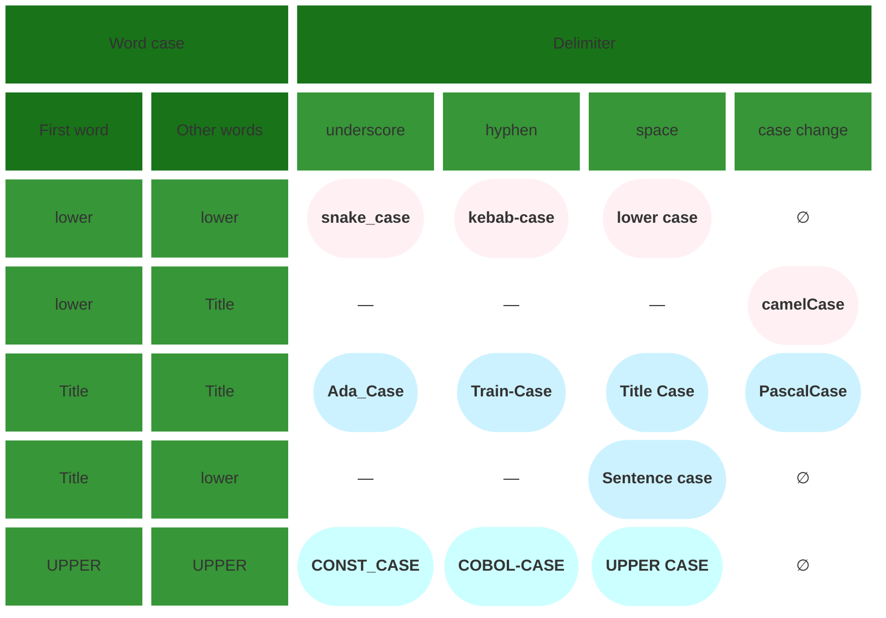

# Cases classification

The two properties bellow let us classify all widely used cases: *word separator* (underscore, hyphen, space, letter case change), and *word case rule*:

* `—` not widely used
* `∅` not possible

## Ambiguity

1. When there is a single word (no separators possible), all 12 cases reduce to 3 classes:
   * `lower` = `camel` = `kebab` = `snake`
   * `Title` = `Ada` = `Pascal` = `Sentence` = `Train`
   * `UPPER` = `COBOL` = `CONST`

2. When there is a single character (Title and UPPER match), all 12 cases reduce to 2 classes:
   * `lower` = `camel` = `kebab` = `snake`
   * `Title` = `Ada` = `Pascal` = `Sentence` = `Train` = `UPPER` = `COBOL` = `CONST`

This makes case detection multivalued when there is a single word or single character.
