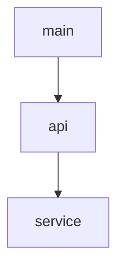
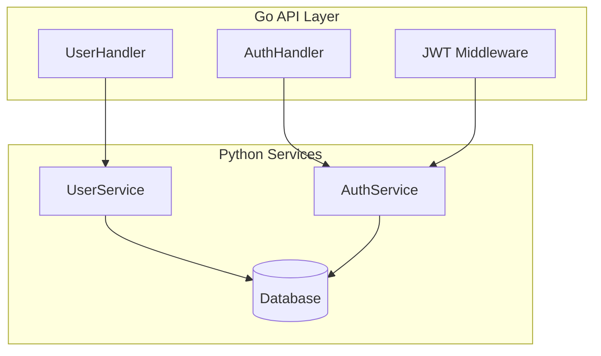

# LLM Project Summarizer
[](https://github.com/MuhammadYossry/llm-project-summarizer/actions/workflows/ci.yml)
[](https://badge.fury.io/py/llm-project-summarizer)
[](https://pypi.org/project/llm-project-summarizer)
[](https://opensource.org/licenses/MIT)

LLM Project Summarizer is a specialized command-line tool that transforms Python and Go codebases into concise, structured summaries optimized for Large Language Models. When working with LLMs like ChatGPT or Claude, sending entire codebases is often impractical due to context limitations. This tool solves that problem by generating intelligent summaries that capture the essential architecture, relationships, and patterns in your code while excluding implementation details.

The tool understands language-specific patterns – in Go, it recognizes packages, interfaces, and implementations; in Python, it comprehends modules, class hierarchies, and type annotations. The output is formatted in Markdown with Mermaid diagrams, making it ideal for LLM consumption and human readability.

## Table of Contents
- [Features](#features)
- [Installation](#installation)
- [Usage](#usage)
- [Configuration](#configuration)
- [How It Works](#how-it-works)
- [Examples](#examples)
- [Contributing](#contributing)
- [Testing](#testing)
- [License](#license)

## Features

✨ **Smart Code Analysis**
- Understands Python and Go code patterns
- Extracts classes, functions, interfaces and their relationships
- Identifies key architectural patterns

📊 **Rich Visualization**
- Generates Mermaid diagrams showing dependency relationships
- Creates hierarchical package/module summaries
- Shows inheritance and implementation relationships

🔧 **Flexible Configuration**
- Exclude patterns and directories
- Customize output format and detail level
- YAML configuration support


## Installation

### Option 1: Install from PyPI
```bash
pip install llm-project-summarizer
```

### Option 2: Install from GitHub
```bash
pip install git+https://github.com/MuhammadYossry/llm-project-summarizer.git
```

### Option 3: Development Installation
```bash
# Clone the repository
git clone https://github.com/MuhammadYossry/llm-project-summarizer
cd llm-project-summarizer

# Install with poetry (recommended for development)
poetry install

# Or install with pip in editable mode
pip install -e .
```


## Usage

### Basic Usage
```bash
# Using pip installed version
llm-project-summarizer /path/to/project

# Custom output file
llm-project-summarizer /path/to/project -o custom_summary.md

# Exclude patterns
llm-project-summarizer /path/to/project --exclude "vendor/*" --exclude "*.test.go"
```

### Using Poetry
```bash
# Install and run using poetry
poetry install
poetry run llm-project-summarizer/path/to/project

# Run with options
poetry run llm-project-summarizer /path/to/project -o summary.md --exclude "vendor/*"
```

### With Configuration File
Create `.summarizer.yaml`:
```yaml
exclude:
  - "vendor/*"
  - "**/*_test.go"
  - "**/__pycache__"
output: "project_summary.md"
```

Use the config:
```bash
llm-project-summarizer /path/to/project --config .summarizer.yaml
```

### Command Line Options
```bash
llm-project-summarizer--help

Options:
  --output, -o PATH    Output file path [default: project_summary.md]
  --exclude, -e TEXT   Exclusion patterns (can be used multiple times)
  --config, -c PATH    Path to config file
  --help              Show this message and exit
```
## How It Works

The tool employs language-specific parsers to analyze source code. For Go, it uses pattern matching to identify packages, interfaces, and implementations. For Python, it utilizes the Abstract Syntax Tree (AST) to extract classes, functions, and their relationships. The parsed information is then organized into a hierarchical structure optimized for LLM understanding.

## Examples

Input project structure:
```
myproject/
├── cmd/
│   └── server/
│       └── main.go
├── internal/
│   ├── api/
│   │   └── handlers.go
│   └── service/
│       └── users.go
```

## Project Generated Summary

## Project Architecture
This is a Go project with the following structure:

### Entry Points
- cmd/server/main.go

### Package Structure
#### api
Key Interfaces:
- Handler: HTTP request handler interface
- Service: Business logic interface

### Dependencies

Here's an example analyzing a mixed Python/Go microservice:

Input project structure:
```
acme-service/
├── api/
│   ├── handlers/
│   │   ├── user_handler.go
│   │   └── auth_handler.go
│   └── middleware/
│       └── jwt.go
├── services/
│   ├── user_service.py
│   └── auth_service.py
└── models/
    ├── user.go
    └── schema.py
```

## Project Generated Summary
## Project Architecture
This is a mixed-language microservice using Go for API handlers and Python for business logic.

### Package Structure

#### api/handlers/user_handler.go
Package: handlers

Symbols:
  interface: UserHandler
    Methods:
      - GetUser(id string) (*User, error)
      - CreateUser(user *User) error
      - UpdateUser(id string, user *User) error

  struct: userHandler
    Implements: UserHandler
    Dependencies: UserService

#### services/user_service.py
Package: services

Symbols:
  class: UserService
    Methods:
      - async def get_user(self, id: str) -> User
      - async def create_user(self, user: User) -> User
      - async def update_user(self, id: str, user: User) -> User
    
    Dependencies: 
      - models.User
      - database.Repository

### Architecture Diagram


## Contributing

We welcome contributions. To get started:

1. Fork the repository
2. Create a feature branch
3. Make your changes
4. Add tests for any new functionality
5. Submit a pull request

## Testing

Run the test suite using Poetry:

```bash
# Run all tests
poetry run pytest

# Run tests with coverage report
poetry run pytest --cov=llm_project_summarizer tests/ --cov-report=term-missing

# Run specific test files
poetry run pytest tests/test_parsers.py
```

## License

This project is licensed under the MIT License
