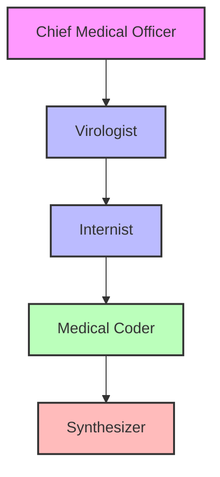
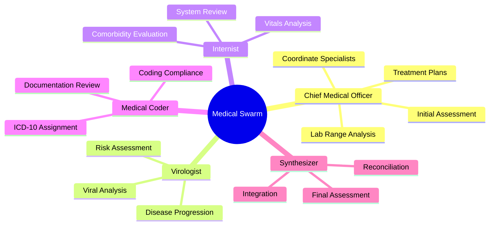
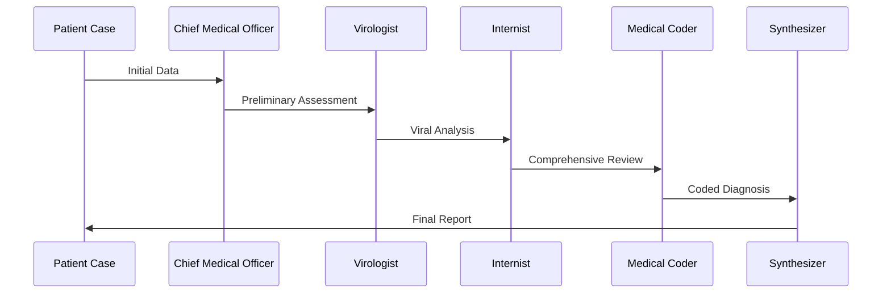

# Medical Diagnosis Swarm Architecture


[](https://discord.gg/agora-999382051935506503) [](https://www.youtube.com/@kyegomez3242) [](https://www.linkedin.com/in/kye-g-38759a207/) [](https://x.com/kyegomezb)

A production-grade multi-agent system for comprehensive medical diagnosis and coding using specialized AI agents.

## Architecture Overview



## Features

- **Specialized Agent Roles**: Each agent has specific medical expertise and responsibilities
- **Structured Diagnostic Flow**: Organized pipeline from initial assessment to final synthesis
- **ICD-10 Coding Integration**: Comprehensive medical coding at each diagnostic stage
- **Automated Report Generation**: Standardized medical and coding reports
- **Evidence-Based Decision Making**: Multi-stage verification and synthesis process

## Agent Responsibilities



## Installation

```bash
pip install swarms
```

## Usage

```python
from swarms import Agent, AgentRearrange
from datetime import datetime

# Initialize agents
chief_medical_officer = Agent(
    agent_name="Chief Medical Officer",
    system_prompt="""...""",
    model_name="gpt-4o",
    max_loops=1
)

# Create agent list and flow
agents = [chief_medical_officer, virologist, internist, medical_coder, synthesizer]
flow = "Chief Medical Officer -> Virologist -> Internist -> Medical Coder -> Synthesizer"

# Initialize swarm system
diagnosis_system = AgentRearrange(
    name="Medical-coding-diagnosis-swarm",
    description="Comprehensive medical diagnosis and coding system",
    agents=agents,
    flow=flow,
    max_loops=1,
    output_type="all"
)

# Process patient case
patient_case = """
Patient: 45-year-old White Male
Lab Results:
- egfr: 59 ml/min/1.73
- non african-american
"""

diagnosis = diagnosis_system.run(patient_case)
```

## Diagnostic Flow Process



## Output Format

The system generates two main types of reports:

1. **Medical Diagnosis Report**: Clinical findings and recommendations
2. **Coding Report**: Structured ICD-10 codes and documentation

Example Report Structure:
```markdown
# Medical Diagnosis and Coding Report
Generated: [Timestamp]

## Clinical Summary
[Diagnosis Details]

## Coding Summary
### Primary Diagnosis Codes
[ICD-10 Codes]

### Secondary Diagnosis Codes
[Additional Codes]

## Recommendations
[Next Steps]
```

## Lab Range Analysis

The system includes specialized functionality for analyzing lab results against diagnostic criteria:

- Automated range checking for common tests (e.g., eGFR)
- Diagnosis-specific range validation
- Multi-factor analysis for complex diagnoses

## Contributing

1. Fork the repository
2. Create your feature branch (`git checkout -b feature/AmazingFeature`)
3. Commit your changes (`git commit -m 'Add some AmazingFeature'`)
4. Push to the branch (`git push origin feature/AmazingFeature`)
5. Open a Pull Request

## License

This project is licensed under the MIT License - see the [LICENSE.md](LICENSE.md) file for details

## Acknowledgments

- Built with the Swarms framework
- Utilizes GPT-4 for advanced medical reasoning
- ICD-10 coding standards compliance

## Contact

For questions and support, please open an issue in the repository.
