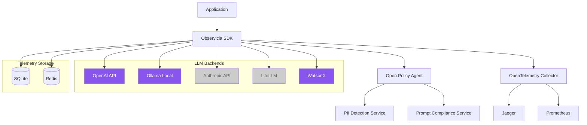

# Observicia SDK

Observicia is a Cloud Native observability and policy control SDK for LLM applications. It provides seamless integration with CNCF native observability stack while offering comprehensive token tracking, policy enforcement, and PII protection capabilities.

[](https://observicia.readthedocs.io/en/latest/)
[](LICENSE)
[](https://opentelemetry.io/)
[](https://www.openpolicyagent.org/)
[](https://badge.fury.io/py/observicia)
[](https://pypi.python.org/pypi/observicia/)

## Features

- **Token Tracking and Management**
  - Real-time token usage monitoring across providers
  - Stream-aware token counting
  - Token usage retention and cleanup
  - Per-session token tracking
  - Configurable data retention policies

- **LLM Backend Support**
  - OpenAI
    - Chat completions (sync/async)
    - Text completions (sync/async)
    - Embeddings
    - Image generation
    - File operations
    - Streaming support
  - Ollama
    - Local model deployment
    - Chat completions
    - Text generation
    - Embeddings
    - Streaming support
  - WatsonX
    - Foundation models integration
    - Text generation
    - Chat completions
    - Parameter controls
  - Basic scaffolding for:
    - Anthropic
    - LiteLLM

- **Transaction Tracking**
  - Multi-round conversation tracking
  - Transaction lifecycle management
  - Metadata and state tracking
  - Parent-child transaction relationships
  - Transaction performance metrics

- **Chat Logging and Analytics**
  - Structured chat history logging
  - Conversation flow analysis
  - Interaction metrics
  - Policy compliance logging
  - Chat completion tracking

- **Telemetry Storage and Export**
  - SQLite exporter for persistent telemetry storage
    - Structured schema for token usage and metrics
    - Transaction and trace correlation
    - Query-friendly format for analytics
  - Redis exporter with configurable retention
    - Time-based data retention policies
    - Real-time metrics access
    - Distributed telemetry storage
  - OpenTelemetry integration
    - Standard OTLP export support
    - Custom attribute mapping
    - Span context preservation

- **Policy Enforcement**
  - Integration with Open Policy Agent (OPA)
  - Support for multiple policy evaluation levels
  - Risk level assessment (low, medium, high, critical)
  - Custom policy definition support
  - Synchronous and asynchronous policy evaluation

- **Framework Integration**
  - LangChain support
    - Conversation chain monitoring
    - Chain metrics
    - Token usage across abstractions

- **Observability Features**
  - OpenTelemetry integration
  - Span-based tracing for all LLM operations
  - Configurable logging (console, file, OTLP)
  - Mermaid diagram generation from telemetry data
  - Detailed request/response tracing
  - Custom attribute tracking

## Quick Start

1. Install the SDK:
```bash
pip install observicia
```

2. Create a configuration file (`observicia_config.yaml`):
```yaml
service_name: my-service
otel_endpoint: http://localhost:4317
opa_endpoint: http://localhost:8181/
policies:
  - name: pii_check
    path: policies/pii
    description: Check for PII in responses
    required_trace_level: enhanced
    risk_level: high
logging:
  file: "app.json"
  telemetry:
    enabled: true
    format: "json"
    redis:
      enabled: true
      host: "localhost"
      port: 6379
      db: 0
      key_prefix: "observicia:telemetry:"
      retention_hours: 24
  messages:
    enabled: true
    level: "INFO"
  chat:
    enabled: true
    level: "both"
    file: "chat.log"
```

3. Initialize in your code:
```python
from observicia import init
from observicia.core.context_manager import ObservabilityContext

# Required - Initialize Observicia
init()

# Optional - Set user ID for tracking
ObservabilityContext.set_user_id("user123")

# Optional - Start a conversation transaction
transaction_id = ObservabilityContext.start_transaction(
    metadata={"conversation_type": "chat"}
)

# Use with OpenAI
from openai import OpenAI
client = OpenAI()
response = client.chat.completions.create(
    model="gpt-4",
    messages=[{"role": "user", "content": "Hello!"}]
)

# Or use with Ollama
import ollama
response = ollama.chat(
    model="llama2",
    messages=[{"role": "user", "content": "Hello!"}]
)

# Optional - End the transaction
ObservabilityContext.end_transaction(
    transaction_id,
    metadata={"resolution": "completed"}
)
```

## Architecture


## Example Applications

The SDK includes three example applications demonstrating different use cases:

## Example Applications

The SDK includes the following example applications demonstrating different use cases:

1. **Simple Chat Application** ([examples/simple-chat](examples/simple-chat))
   - Basic chat interface using OpenAI
   - Demonstrates token tracking and tracing
   - Shows streaming response handling
   - Includes transaction management

2. **RAG Application** ([examples/rag-app](examples/rag-app))
   - Retrieval-Augmented Generation example
   - Shows policy enforcement for PII protection
   - Demonstrates context tracking
   - Includes secure document retrieval

3. **LangChain Chat** ([examples/langchain-chat](examples/langchain-chat))
   - Integration with LangChain framework
   - Shows conversation chain tracking
   - Token tracking across abstractions

4. **WatsonX Generation** ([examples/watsonx-generate](examples/watsonx-generate))
   - Integration with IBM WatsonX.ai Foundation Models
   - Demonstrates model inference with parameters
   - Shows token tracking for WatsonX models
   - Includes chat and generation examples
   - Policy enforcement for enterprise use cases

5. **Ollama Generation** ([examples/ollama-generate](examples/ollama-generate))
   - Integration with local Ollama models
   - Shows local model deployment monitoring
   - Demonstrates both chat and generation modes
   - Includes embedding tracking
   - Token usage tracking for local models
   - Support for multiple model formats

## Deployment

### Prerequisites

- Kubernetes cluster with:
  - OpenTelemetry Collector
  - Open Policy Agent
  - Jaeger (optional)
  - Prometheus (optional)

### Example Kubernetes Deployment

See the [deploy/k8s](deploy/k8s) directory for complete deployment manifests.

## Core Components

- **Context Manager**: Manages trace context, transactions and session tracking
- **Policy Engine**: Handles policy evaluation and enforcement
- **Token Tracker**: Monitors token usage across providers
- **Patch Manager**: Manages LLM provider SDK instrumentation
- **Tracing Manager**: Handles OpenTelemetry integration

## Token Usage Visualization

The SDK includes sample tools to visualize token usage metrics through Grafana dashboards.

[](https://www.youtube.com/watch?v=IkYBNWHVIXQ)


## Development Status

- ✅ Core Framework
- ✅ OpenAI Integration
- ✅ Basic Policy Engine
- ✅ Token Tracking
- ✅ OpenTelemetry Integration
- ✅ Transaction Management
- ✅ Chat Logging
- ✅ LangChain Support
- 🚧 Additional Provider Support
- 🚧 Advanced Policy Features
- 🚧 UI Components

## License

This project is licensed under the Apache License 2.0 - see the [LICENSE](LICENSE) file for details.