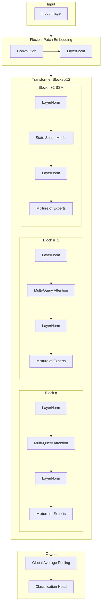
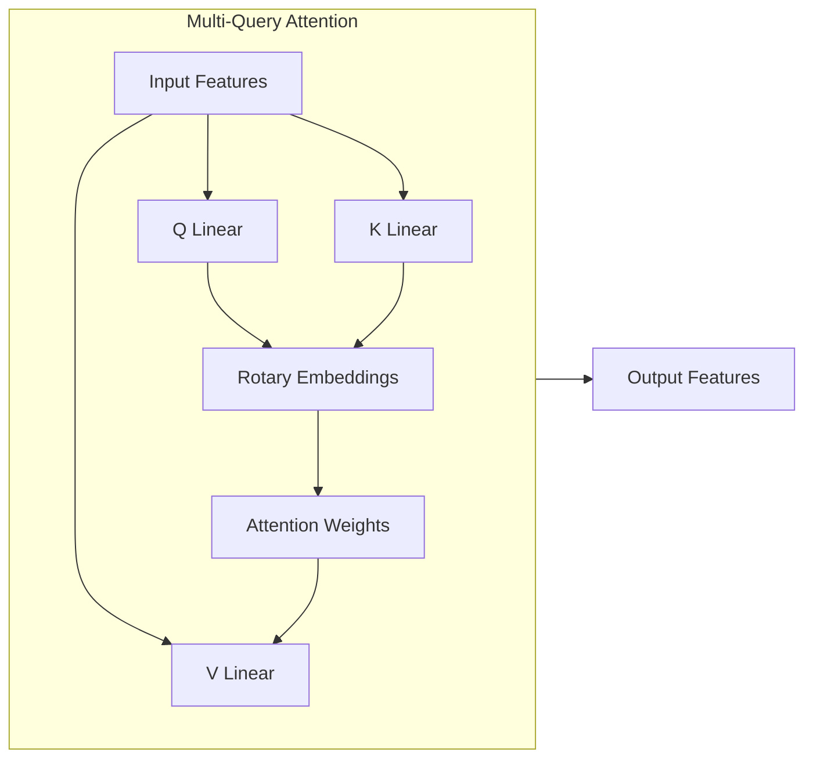

# OmegaViT: A State-of-the-Art Vision Transformer with Multi-Query Attention, State Space Modeling, and Mixture of Experts

[](https://discord.gg/agora-999382051935506503) [](https://www.youtube.com/@kyegomez3242) [](https://www.linkedin.com/in/kye-g-38759a207/) [](https://x.com/kyegomezb)


[](https://badge.fury.io/py/omegavit)
[](https://opensource.org/licenses/MIT)
[](https://github.com/Agora-Lab-AI/OmegaViT/actions)
[](https://omegavit.readthedocs.io/en/latest/?badge=latest)

OmegaViT (ΩViT) is a cutting-edge vision transformer architecture that combines multi-query attention, rotary embeddings, state space modeling, and mixture of experts to achieve superior performance across various computer vision tasks. The model can process images of any resolution while maintaining computational efficiency.

## Key Features

- **Flexible Resolution Processing**: Handles arbitrary input image sizes through adaptive patch embedding
- **Multi-Query Attention (MQA)**: Reduces computational complexity while maintaining model expressiveness
- **Rotary Embeddings**: Enables better modeling of relative positions and spatial relationships
- **State Space Models (SSM)**: Integrates efficient sequence modeling every third layer
- **Mixture of Experts (MoE)**: Implements conditional computation for enhanced model capacity
- **Comprehensive Logging**: Built-in loguru integration for detailed execution tracking
- **Shape-Aware Design**: Continuous tensor shape tracking for reliable processing

## Architecture



## Multi-Query Attention Detail



## Installation

```bash
pip install omegavit
```

## Quick Start

```python
import torch
from omegavit import create_advanced_vit

# Create model
model = create_advanced_vit(num_classes=1000)

# Example forward pass
batch_size = 8
x = torch.randn(batch_size, 3, 224, 224)
output = model(x)
print(f"Output shape: {output.shape}")  # [8, 1000]
```

## Model Configurations

| Parameter | Default | Description |
|-----------|---------|-------------|
| hidden_size | 768 | Dimension of transformer layers |
| num_attention_heads | 12 | Number of attention heads |
| num_experts | 8 | Number of expert networks in MoE |
| expert_capacity | 32 | Tokens per expert in MoE |
| num_layers | 12 | Number of transformer blocks |
| patch_size | 16 | Size of image patches |
| ssm_state_size | 16 | Hidden state size in SSM |

## Performance

*Note: Benchmarks coming soon*

## Citation

If you use OmegaViT in your research, please cite:

```bibtex
@article{omegavit2024,
  title={OmegaViT: A State-of-the-Art Vision Transformer with Multi-Query Attention, State Space Modeling, and Mixture of Experts},
  author={Agora Lab},
  journal={arXiv preprint arXiv:XXXX.XXXXX},
  year={2024}
}
```

## Contributing

We welcome contributions! Please see our [contributing guidelines](CONTRIBUTING.md) for details.

## License

This project is licensed under the MIT License - see the [LICENSE](LICENSE) file for details.

## Acknowledgments

Special thanks to the Agora Lab AI team and the open-source community for their valuable contributions and feedback.
